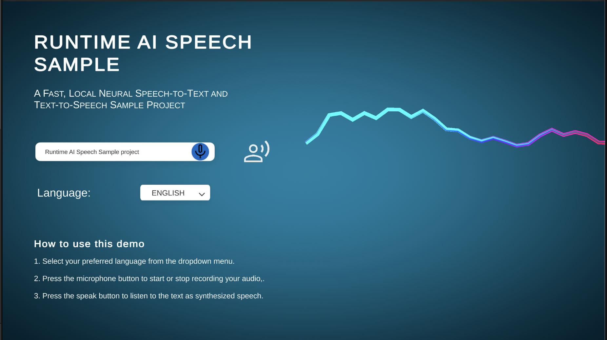
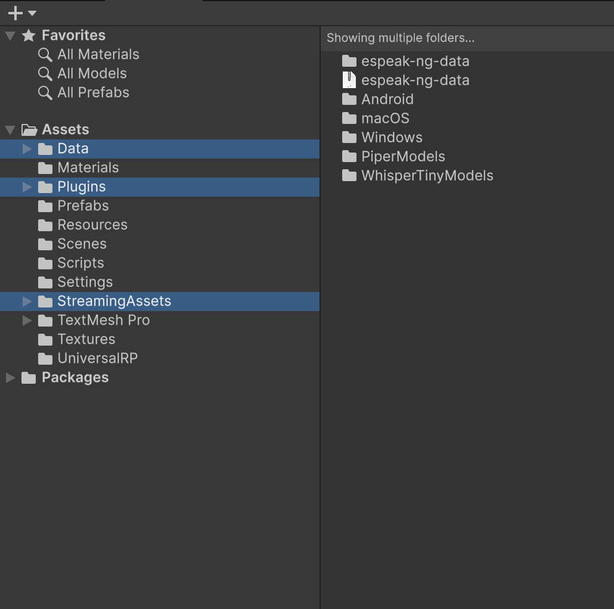
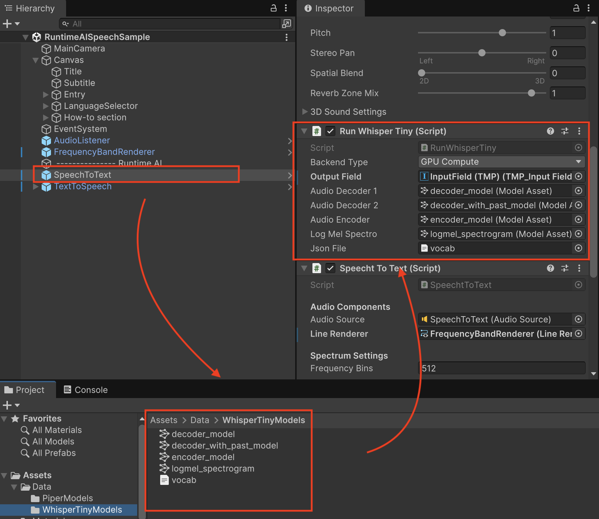
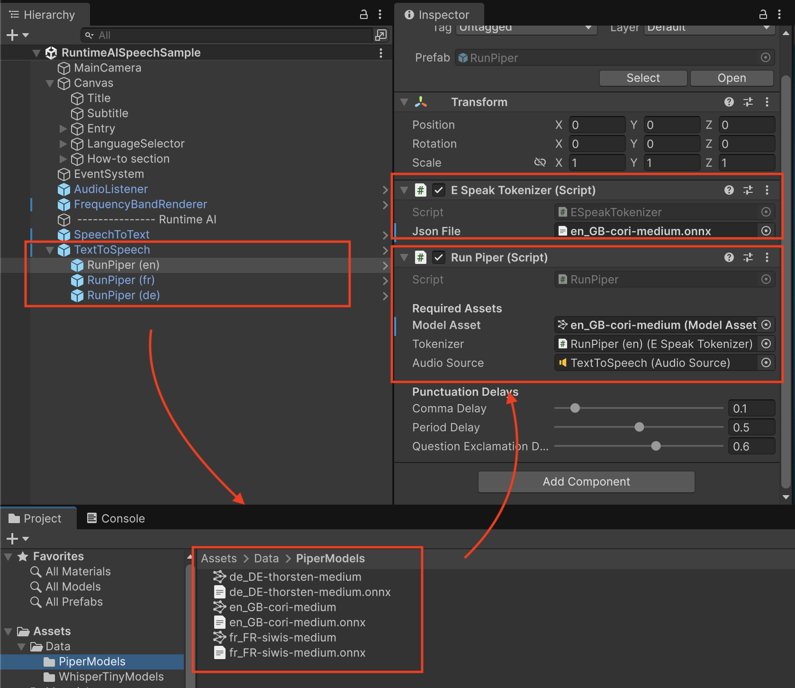

# WhisperTiny Speech-To-Text and Piper Text-To-Speech for Unity

This project demonstrates the use of [WhisperTiny](https://arxiv.org/abs/2212.04356) models within the Unity Inference Engine for Speech to Text conversion.

This project demonstrates the use of [Piper](https://github.com/OHF-Voice/piper1-gpl) models within the Unity Inference Engine for Text to Speech synthesis.

Whisper is a model that was trained on labelled data for automatic speech recognition (ASR) and speech translation. 
Whisper was proposed in the paper [Robust Speech Recognition via Large-Scale Weak Supervision](https://arxiv.org/abs/2212.04356) by Alec Radford et al from OpenAI.

Piper language models are efficient, fully local neural Text-to-Speech (TTS) models designed for fast and high-quality voice generation. 

The Piper engine uses the espeak-ng synthesizer for phonemization, which converts text into phonemes before they are processed by the neural model. This approach ensures accurate pronunciation across multiple languages while maintaining low latency, making Piper suitable for real-time applications and offline use.

## Key Features

- **Speech Input**: Perform local speech-to-text using neural inference
- **Multilingual Support**: Supports English, German, French voice input.
- **Speech Output**: Perform local speech synthesis using neural inference with any of the [language models](https://huggingface.co/rhasspy/piper-voices)

## Requirements

- **Unity**: `6000.2.6f1`
- **Inference Engine**: `2.3.0`

##  Models (ONNX)

You can download the WhisperTiny models from the [Unity repository](https://huggingface.co/unity/inference-engine-whisper-tiny) on Hugging Face.

You can download the Piper voice models from the repository on [Hugging Face](https://huggingface.co/rhasspy/piper-voices) and browse language models on the [Samples](https://rhasspy.github.io/piper-samples/) page. 

## Getting Started

### Project Setup

1. Clone or download this repository.
2. Download the model assets and the espeak-ng plugin from [`here`](https://drive.google.com/file/d/11YeEAFsK_75mYJVibmLuOg8ujYmG7t4K/).

    Extract the contents of CopyContentToAssetsFolder.zip.
    Inside, you’ll find three items:
    - the data folder containing the ONNX models
    - the espeak-ng synthesizer plugin
    - the phonemization list
    
    Copy all three into your project’s /Assets/ directory.

Steps 3 and 4 are only required if the models are not automatically linked to the Neural Text Generation prefab or the Neural Speech Generation prefab.

3. Add the model assets to the **RunWhisper** component of the **SpeechToText** prefab.

4. Add the model assets to the **RunPiper** component of the **TextToSpeech** prefab.

### Run the Demo Scene

1. Open the `/Assets/Scenes/Runtime AI Sample Scene.unity` scene in the Unity Editor.
2. Run the scene to see test the Speech-To-Text conversion and Text-To-Speech synthesis

## How to Use

When you press the Record button, the microphone activates and audio is captured into an AudioClip. Pressing the button again stops the recording.

The recorded audio is then processed by WhisperTiny for speech recognition.

Use the dropdown menu to select the desired input and output languages. Once processing is complete, the recognized text will appear in the text field.

You can also type text directly into the field to test the Piper model speech synthesis.

Speech-to-Text and Text-to-Speech function independently, but in this demo they are combined to showcase the full round trip.

The espeak-ng synthesizer plugin supports Android, Windows, and macOS (x64) out of the box. For other platforms, please refer to the espeak-ng repository.

Try yourself:

## License

This project depends on 3rd party neural networks. Please refer to the orignial [WhisperTiny](https://huggingface.co/openai/whisper-tiny), [Piper](https://huggingface.co/openai/whisper-tiny), and [eSpeak-ng](https://huggingface.co/openai/whisper-tiny) repositories for detailed license information.
